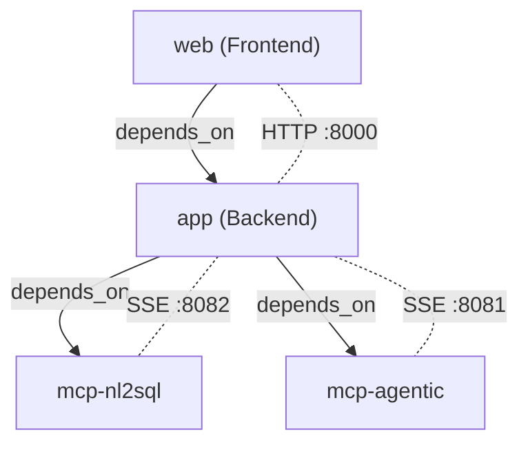

# Talk2Data — Microservices Architecture Guide

> **Last updated:** 2026-02-13

---

## Table of Contents

1. [Architecture Overview](#architecture-overview)
2. [Service Inventory](#service-inventory)
3. [Inter-Service Dependencies](#inter-service-dependencies)
4. [Environment & Configuration](#environment--configuration)
5. [Docker Setup & Commands](#docker-setup--commands)
6. [Host Volume Mounts & Symlinks](#host-volume-mounts--symlinks)
7. [File-by-File Reference](#file-by-file-reference)
8. [Unused Files & Cleanup Candidates](#unused-files--cleanup-candidates)
9. [Troubleshooting](#troubleshooting)

---

## Architecture Overview

```
┌─────────────┐     HTTP (port 3000)
│   Frontend   │◄──── Browser
│   (Next.js)  │
└──────┬───────┘
       │ NEXT_PUBLIC_API_URL
       │ http://localhost:8000
       ▼
┌─────────────┐     HTTP (port 8000)
│   Backend    │◄──── REST API
│  (FastAPI)   │
└──┬───────┬───┘
   │ SSE   │ SSE
   ▼       ▼
┌──────┐ ┌──────┐
│NL2SQL│ │Agent.│    MCP Servers
│ MCP  │ │Tools │    (FastMCP / SSE)
│:8082 │ │ MCP  │
│      │ │:8081 │
└──────┘ └──────┘
```

All four services run as independent Docker containers orchestrated by `docker-compose.yml`. Communication between backend and MCP servers uses **Server-Sent Events (SSE)** over HTTP on the Docker bridge network.

---

## Service Inventory

### 1. Frontend (`web`)

| Property | Value |
|---|---|
| **Dockerfile** | `web/Dockerfile` |
| **Base image** | `node:20-alpine` (multi-stage) |
| **Framework** | Next.js 16.1.4 + React 19 + TypeScript 5 |
| **Port** | `3000` |
| **Entry point** | `node server.js` (standalone output) |
| **Build context** | `./web` |

**Key config:** `next.config.ts` sets `output: 'standalone'` to enable the multi-stage Docker build.

**Key dependencies:** `react-markdown`, `mermaid`, `vega-embed`, `@ai-sdk/react`, `tailwindcss v4`.

---

### 2. Backend (`app`)

| Property | Value |
|---|---|
| **Dockerfile** | `Dockerfile.backend` |
| **Base image** | `python:3.11-slim` |
| **Framework** | FastAPI + Uvicorn |
| **Port** | `8000` |
| **Entry point** | `uvicorn app.main:app --host 0.0.0.0 --port 8000` |
| **Build context** | `.` (project root) |

**Key modules:**

| Module | Purpose |
|---|---|
| `app/main.py` | FastAPI app + lifespan (DB init, MCP refresh) |
| `app/api.py` | REST API routes |
| `app/agent.py` | LangGraph agent, OCI GenAI / OpenAI integration |
| `app/mcp_manager.py` | MCP client connections (SSE transport) |
| `app/config.py` | Pydantic settings from `.env` |
| `app/database.py` | SQLAlchemy async engine (Oracle ADB) |
| `app/services/title_generator.py` | Conversation title generation |
| `app/tool_visibility.py` | Tool enable/disable settings |
| `app/tool_approval.py` | Human-in-the-loop tool approval |
| `app/tool_description.py` | Custom tool description overrides |
| `app/app_settings.py` | Application-wide settings (debug logging, etc.) |

**Key Python dependencies:** `fastapi`, `uvicorn`, `langchain`, `langchain-oci`, `langgraph`, `oci-openai`, `mcp`, `fastmcp`, `oracledb`, `sqlalchemy`, `httpx`.

---

### 3. NL2SQL MCP Server (`mcp-nl2sql`)

| Property | Value |
|---|---|
| **Dockerfile** | `Dockerfile.mcp_nl2sql` |
| **Base image** | `python:3.11-slim` |
| **Framework** | FastMCP (SSE transport) |
| **Port** | `8082` |
| **Entry point** | `python nl2sql_mcp_server.py` |
| **Build context** | `.` (project root) |
| **Env file** | `.env` (shared) + env overrides in compose |

Provides natural-language-to-SQL tools. Connects to Oracle Autonomous Database using dedicated NL2SQL credentials (`ORACLE_NL2SQL_*`).

---

### 4. Agentic Tools MCP Server (`mcp-agentic`)

| Property | Value |
|---|---|
| **Dockerfile** | `Dockerfile.mcp_agentic` |
| **Base image** | `python:3.11-slim` |
| **Framework** | FastMCP (SSE transport) |
| **Port** | `8081` |
| **Entry point** | `python agentic_tools_mcp_server.py` |
| **Build context** | `.` (project root) |
| **Env file** | `.env` (shared) |

Provides general-purpose agentic tools (web search, document parsing, etc.). Currently has no additional API keys configured (`.env.agentic_tools` is a placeholder).

---

### 5. SalesDB MCP Server (Stdio — Host Only)

| Property | Value |
|---|---|
| **Transport** | Stdio (subprocess) |
| **Command** | `/opt/homebrew/Caskroom/sqlcl/25.3.2.317.1117/sqlcl/bin/sql` |
| **Runtime** | Java (JDK/JRE required by SQLCL) |
| **Containerized?** | ❌ **No** |

> [!WARNING]
> **This server does NOT work inside Docker.** It is a Stdio-based MCP server that requires the backend to spawn SQLCL as a local subprocess. SQLCL is a Java application installed via Homebrew on macOS. The `python:3.11-slim` Docker image has neither Java nor SQLCL, so the backend cannot launch it.

**When does it work?**
- ✅ Running the backend **locally** (outside Docker) on a Mac with SQLCL installed
- ❌ Running the backend **inside Docker** — the subprocess call fails because the binary doesn't exist

**Future containerization options:**
1. **Install Java + SQLCL in `Dockerfile.backend`** — Increases image size by ~400MB+
2. **Create a separate SSE container** — Wrap SQLCL in a Python SSE server (new Dockerfile with Java + SQLCL + FastMCP)
3. **Keep as host-only** — Use NL2SQL MCP for SQL capabilities in Docker mode

---

## Inter-Service Dependencies



| Dependency | Type | Description |
|---|---|---|
| `web` → `app` | **Startup order** | Frontend waits for backend to be created before starting |
| `app` → `mcp-nl2sql` | **Startup order + Runtime** | Backend connects to NL2SQL MCP via SSE at `http://mcp-nl2sql:8082/sse` |
| `app` → `mcp-agentic` | **Startup order + Runtime** | Backend connects to Agentic MCP via SSE at `http://mcp-agentic:8081/sse` |
| `mcp-nl2sql` → (none) | **Independent** | No service dependencies; connects directly to Oracle DB |
| `mcp-agentic` → (none) | **Independent** | No service dependencies |

> **Important:** While `depends_on` controls container startup **order**, it does NOT wait for the service to be healthy. If the backend starts faster than the MCP servers, it will retry connections internally via `mcp_manager.py`.

> **Service Communication:** The MCP servers are NOT called from the frontend. ALL MCP communication goes through the backend, which acts as the sole orchestrator. The frontend only communicates with the backend via REST API.

---

## Environment & Configuration

### Shared `.env` (root)

Used by backend (`app`) and loaded via `env_file` by all services.

| Variable | Used By | Purpose |
|---|---|---|
| `OCI_CONFIG_FILE` | Backend | Path to OCI CLI config (default: `~/.oci/config`) |
| `OCI_PROFILE` | Backend | OCI config profile name |
| `COMPARTMENT_ID` | Backend, MCP servers | OCI compartment ID for GenAI calls |
| `ORACLE_DB_DSN` | Backend | Oracle ADB connect string for app DB |
| `ORACLE_DB_USER` | Backend | App database user |
| `ORACLE_DB_PASSWORD` | Backend | App database password |
| `ORACLE_WALLET_PATH` | Backend | Path to Oracle Wallet directory |
| `ORACLE_WALLET_PASSWORD` | Backend | Oracle Wallet password |

### Service-Specific Env Files

| File | Service | Status |
|---|---|---|
| `.env.nl2sql` | `mcp-nl2sql` | **Not currently used in docker-compose** (compose uses `.env` + env overrides). Contains `ORACLE_NL2SQL_*` vars. |
| `.env.agentic_tools` | `mcp-agentic` | **Placeholder only** — empty except for comments. |

### Docker Compose Environment Overrides

These environment variables are set directly in `docker-compose.yml` and **override** values from `.env`:

| Variable | Container Value | Purpose |
|---|---|---|
| `NEXT_PUBLIC_API_URL` | `http://localhost:8000` | Browser → Backend URL (web) |
| `NL2SQL_MCP_URL` | `http://mcp-nl2sql:8082/sse` | Backend → NL2SQL MCP (docker network) |
| `AGENTIC_MCP_URL` | `http://mcp-agentic:8081/sse` | Backend → Agentic MCP (docker network) |
| `ORACLE_WALLET_PATH` | `/wallet` | Overrides host path for containers |
| `ORACLE_NL2SQL_WALLET_PATH` | `/wallet` | Overrides host path for mcp-nl2sql |

---

## Docker Setup & Commands

### Prerequisites

1. **Docker Desktop** or **Rancher Desktop** installed and running
2. **OCI CLI config** at `~/.oci/config` with a valid PEM key
3. **Oracle Wallet** at `~/Desktop/T2D/Wallet_TECPDATP01/`
4. **`.env` file** populated at project root

### Quick Start

```bash
# Build all services then start
./run_local.sh build

# Start without rebuilding (uses cached images)
./run_local.sh
```

### Docker Compose Commands

```bash
# Build all services
docker compose build

# Build a single service (e.g., backend only)
docker compose build app

# Force rebuild without cache (required after dependency changes)
docker compose build --no-cache app

# Start all services
docker compose up

# Start in detached mode
docker compose up -d

# View logs for a specific service
docker compose logs -f app

# Stop all services
docker compose down

# Stop and remove volumes
docker compose down -v

# Full rebuild cycle (recommended after pyproject.toml or Dockerfile changes)
docker compose build --no-cache && docker compose up
```

### Service Ports

| Service | Host Port | Container Port |
|---|---|---|
| Frontend | `3000` | `3000` |
| Backend | `8000` | `8000` |
| NL2SQL MCP | `8082` | `8082` |
| Agentic MCP | `8081` | `8081` |

### Health Check URLs

```bash
# Backend health
curl http://localhost:8000/

# Frontend (browser)
open http://localhost:3000
```

---

## Host Volume Mounts & Symlinks

### Volume Mounts

| Service | Host Path | Container Path | Mode | Purpose |
|---|---|---|---|---|
| `app` | `~/.oci` | `/root/.oci` | `ro` | OCI SDK authentication config + PEM keys |
| `app` | `~/Desktop/T2D/Wallet_TECPDATP01` | `/wallet` | `ro` | Oracle Autonomous DB wallet |
| `mcp-nl2sql` | `~/.oci` | `/root/.oci` | `ro` | OCI SDK authentication |
| `mcp-nl2sql` | `~/Desktop/T2D/Wallet_TECPDATP01` | `/wallet` | `ro` | Oracle wallet for NL2SQL queries |
| `mcp-agentic` | `~/.oci` | `/root/.oci` | `ro` | OCI SDK authentication |

### Symlink (Backend Dockerfile)

```dockerfile
RUN mkdir -p /Users/ashwins && ln -s /root/.oci /Users/ashwins/.oci
```

**Why:** The `~/.oci/config` file contains a Mac absolute `key_file` path:
```
key_file=/Users/ashwins/.oci/ASHWIN.SRINIVASAN@ORACLE.COM-2025-11-04T10_31_35.012Z.pem
```

Inside the container, `~/.oci` maps to `/root/.oci` — but the OCI SDK reads the `key_file` path literally. The symlink creates `/Users/ashwins/.oci` → `/root/.oci` so the Mac path resolves correctly inside the container.

> **⚠️ Note:** This symlink is developer-specific. For a team setup or CI/CD, consider using `~/.oci/` relative paths in the OCI config or instance principal auth.

---

## File-by-File Reference

### Project Root

| File/Directory | Type | Purpose | Used In Docker? |
|---|---|---|---|
| `docker-compose.yml` | Config | Orchestrates all 4 services | N/A (host only) |
| `Dockerfile.backend` | Dockerfile | Backend image build | ✅ |
| `Dockerfile.mcp_nl2sql` | Dockerfile | NL2SQL MCP image build | ✅ |
| `Dockerfile.mcp_agentic` | Dockerfile | Agentic MCP image build | ✅ |
| `pyproject.toml` | Config | Python dependencies (shared by all Python services) | ✅ |
| `run_local.sh` | Script | Auto-detect Docker/nerdctl and run | N/A (host only) |
| `.env` | Config | Environment variables | ✅ (mounted via `env_file`) |
| `.env.nl2sql` | Config | NL2SQL-specific env vars | ❌ Not used by compose |
| `.env.agentic_tools` | Config | Placeholder for agentic env vars | ❌ Not used by compose |
| `.dockerignore` | Config | Excludes files from Docker build context | ✅ |
| `.gitignore` | Config | Git exclusions | N/A |
| `nl2sql_mcp_server.py` | Source | NL2SQL MCP server entry point | ✅ |
| `agentic_tools_mcp_server.py` | Source | Agentic Tools MCP server entry point | ✅ |
| `README.md` | Docs | Project readme | ❌ |

### `app/` Directory (Backend)

| File | Purpose |
|---|---|
| `__init__.py` | Package init |
| `main.py` | FastAPI app, lifespan, CORS, health check |
| `api.py` | REST API routes (chat, conversations, settings, files) |
| `agent.py` | LangGraph agent, OCI GenAI + OpenAI integration, tool execution |
| `config.py` | Pydantic settings loaded from `.env` |
| `database.py` | SQLAlchemy async engine, Oracle ADB models, CRUD operations |
| `mcp_manager.py` | MCP client manager (SSE connections to MCP servers) |
| `app_settings.py` | Application-level settings (debug log path, etc.) |
| `tool_visibility.py` | Enable/disable individual MCP tools |
| `tool_approval.py` | Human-in-the-loop tool approval config |
| `tool_description.py` | Custom tool description overrides |
| `services/__init__.py` | Services package init |
| `services/title_generator.py` | Auto-generates conversation titles via LLM |

### `web/` Directory (Frontend)

| File | Purpose |
|---|---|
| `Dockerfile` | Multi-stage Next.js build |
| `package.json` | npm dependencies |
| `next.config.ts` | Next.js config (`output: 'standalone'`) |
| `tsconfig.json` | TypeScript configuration |
| `app/` | Next.js app router (pages, components, styles) |
| `public/` | Static assets |

### `scripts/` Directory

| File | Purpose |
|---|---|
| `cleanup_old_conversations.py` | Utility to clean up old conversations from DB |
| `debug_oracle_insert.py` | Debug script for Oracle inserts |
| `fix_oracle_identity.py` | Fix Oracle identity column issues |
| `migrate_sqlite_to_oracle.py` | One-time migration from SQLite to Oracle ADB |

### `docs/` Directory

| File | Purpose |
|---|---|
| `NL2SQL_MCP_SERVER.md` | NL2SQL MCP server documentation |
| `TECHNICAL_DESIGN.md` | Technical design document |

---

## Unused Files & Cleanup Candidates

The following files and directories are **not required** for the containerized application and can be safely removed or archived:

### 🔴 High Priority (Large / Clearly Unused)

| Path | Size | Reason |
|---|---|---|
| `local_app.db` | **284 MB** | Legacy SQLite database from pre-Oracle migration. App now uses Oracle ADB. Already in `.gitignore` and `.dockerignore`. **Delete to reclaim disk space.** |
| `frontend/` | ~0 (contains only `.next/`) | **Defunct directory.** The active frontend is `web/`. This appears to be a leftover from an older frontend setup. Contains only a stale `.next` build cache. **Safe to delete.** |
| `.git.backup/` | Unknown | Git backup directory. Already in `.gitignore` and `.dockerignore`. **Safe to delete.** |

### 🟡 Medium Priority (Dev Artifacts / One-Time Scripts)

| Path | Size | Reason |
|---|---|---|
| `oracledbtest.py` | 1.7 KB | One-time test script for Oracle DB connectivity. Not part of any service. **Can be moved to `scripts/` or deleted.** |
| `scripts/migrate_sqlite_to_oracle.py` | 9 KB | One-time migration script (SQLite → Oracle). Migration is complete. **Archive or delete.** |
| `scripts/debug_oracle_insert.py` | 1.9 KB | Debug script. Not part of any service. **Can be deleted.** |
| `scripts/fix_oracle_identity.py` | 5.4 KB | One-time fix script. **Archive or delete.** |
| `mcpenv/` | Unknown | Virtual environment directory (not needed with Docker). Already in `.gitignore` and `.dockerignore`. **Delete.** |
| `.mcpenv/` | Unknown | Another virtual env directory. **Delete.** |
| `__pycache__/` | Unknown | Python bytecode cache at root level. Already in `.gitignore`. **Delete.** |

### 🟢 Low Priority (Config / Future Consideration)

| Path | Size | Reason |
|---|---|---|
| `.env.nl2sql` | 367 B | Service-specific env file. Not used by `docker-compose.yml` (compose uses `.env` + `environment:` overrides). **Keep for reference, or integrate into compose.** |
| `.env.agentic_tools` | 106 B | Empty placeholder. **Keep if planning to add API keys, otherwise delete.** |
| `aiosqlite` in `pyproject.toml` | — | Dependency for SQLite. If fully migrated to Oracle ADB, this is no longer needed. **Remove from `pyproject.toml` if SQLite is not used.** |

### Cleanup Command

```bash
# Remove high-priority items
rm -f local_app.db
rm -rf frontend/
rm -rf .git.backup/
rm -rf mcpenv/ .mcpenv/ __pycache__/

# Remove one-time scripts (optional)
rm -f oracledbtest.py
```

---

## Troubleshooting

### Build Fails with Dependency Conflicts
```bash
# Force clean rebuild
docker compose build --no-cache <service>
```

### OCI Config Not Found Inside Container
Ensure `~/.oci/config` exists on your Mac and the PEM key path is valid. The backend Dockerfile creates a symlink for Mac absolute paths:
```
/Users/ashwins/.oci → /root/.oci
```

### Oracle Wallet Not Found Inside Container
Ensure the wallet directory exists at `~/Desktop/T2D/Wallet_TECPDATP01/` and contains `tnsnames.ora`, `sqlnet.ora`, and `cwallet.sso`.

### MCP Servers Not Connecting
Check that MCP servers are running before the backend starts:
```bash
docker compose logs mcp-nl2sql
docker compose logs mcp-agentic
```
The backend will retry connections via `mcp_manager.py`.

### Frontend Build Fails (SSL/TLS Error)
The `web/Dockerfile` includes workarounds for corporate proxy TLS interception:
```dockerfile
ENV NODE_TLS_REJECT_UNAUTHORIZED=0
RUN npm config set strict-ssl false
```

### Stdio MCP Servers (e.g., SalesDB) Not Working in Docker
Stdio-based MCP servers launch tools as **local subprocesses**. If the required binary (e.g., SQLCL at `/opt/homebrew/Caskroom/sqlcl/.../bin/sql`) is not installed inside the Docker container, the server will fail silently — showing "No tools available" in the UI. A symlink **will not fix this** because the binary and its runtime (Java) are simply not present in the container. See [SalesDB MCP Server](#5-salesdb-mcp-server-stdio--host-only) for options.

### Stale Oracle DB Connections (DPY-4011)
If you see `DPY-4011: the database or network closed the connection` errors, the Oracle ADB dropped an idle connection. The engine is configured with `pool_pre_ping=True` and `pool_recycle=300` to handle this automatically. If errors persist, restart the backend:
```bash
docker compose restart app
```
